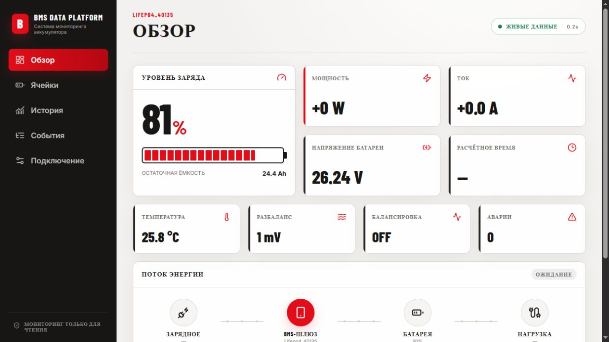
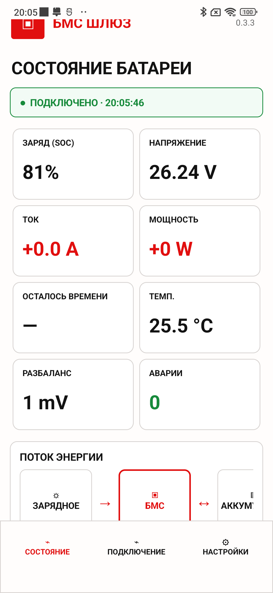
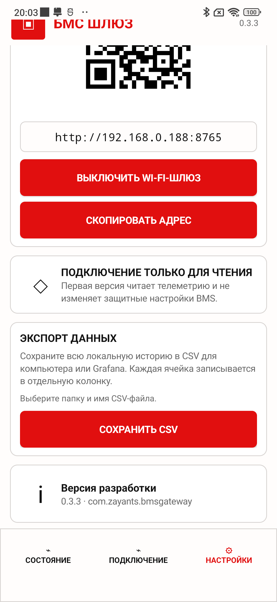
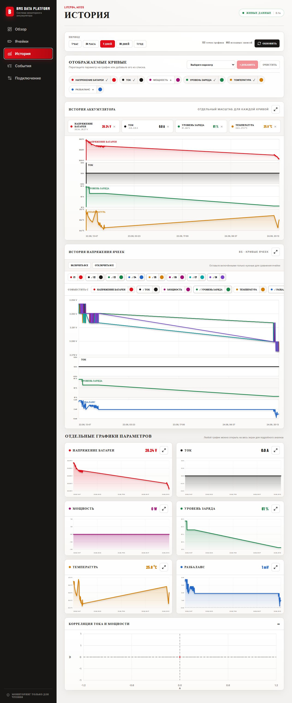
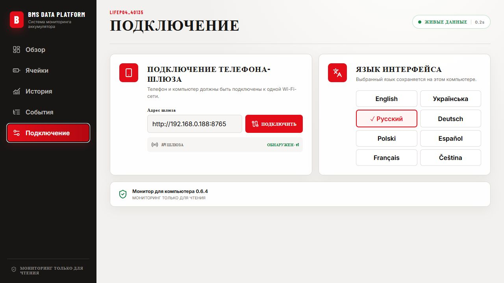

# BMS Data Platform

Read-only monitoring system for JK/Jikong BMS: an Android phone works as a Bluetooth gateway and logger, while the Windows dashboard provides a large local-network view and long-term diagnostics.

**Latest release: 0.7.31** · [Download APK and Windows package](https://github.com/zayants/bms-data-platform/releases/tag/v0.7.31) · [Connection guide](docs/connection-guide-ru.md)

## What it is for

The phone stays near the battery, keeps the BLE connection and stores telemetry locally. A computer, tablet or TV on the same Wi-Fi network can open the dashboard in a browser or use the Windows monitor. No cloud account is required.

## Included

- **BMS Gateway 0.4.5 (Android 8.0+)** — scan and manually select a BMS, live telemetry, automatic reconnect, up to 32 cells, local history, CSV export and local Wi-Fi API.
- **BMS Data Platform 0.7.31 (Windows x64)** — overview, energy flow, cell grid, stale-data indication, history, configurable charts, BMS and user thresholds, SOC boundary markers, imbalance diagnostics, SQL/Excel export and incremental history synchronisation.
- English, Ukrainian, Russian, German, Polish, Spanish, French and Czech interface resources.

## Screenshots

| Android gateway | Windows overview |
|---|---|
|  |  |

| Phone Wi-Fi gateway | History and diagnostics |
|---|---|
|  |  |

## Compatibility and safety

The gateway supports JK/Jikong telemetry variants based on JK02 and JK04 protocols, including many 8S–32S models. Firmware and Bluetooth naming vary, so reports from untested BMS models are welcome.

The preview is read-only: it does not change protection parameters or write settings to the BMS. Bluetooth discovery may require Android system Location to be enabled, although the app does not read or store location. Close the official JK app before connecting because a BMS normally accepts one active Bluetooth client at a time.

## Quick start

1. Install the Android APK on a phone placed near the battery.
2. Enable Bluetooth and, if Android requests it, system Location. Scan and select the required BMS.
3. Connect phone and computer to the same Wi-Fi network.
4. Enable the phone Wi-Fi gateway and copy its local address.
5. Enter that address on the Windows monitor connection page.

## Downloads

- [Android Gateway 0.4.5 APK](https://github.com/zayants/bms-data-platform/releases/download/v0.7.31/BMS-Gateway-0.4.5-Android.apk)
- [Windows Monitor 0.7.31 x64](https://github.com/zayants/bms-data-platform/releases/download/v0.7.31/BMS-Data-Platform-0.7.31-Windows-x64.zip)
- [All release files](https://github.com/zayants/bms-data-platform/releases/tag/v0.7.31)

---

## Русская версия

**BMS Data Platform** — система мониторинга JK/Jikong BMS только для чтения. Телефон находится рядом с аккумулятором, поддерживает Bluetooth-связь и записывает историю. Компьютер, планшет или телевизор в той же Wi-Fi-сети могут отображать данные через браузер или Windows-монитор.

**Последняя версия: 0.7.31** · [Скачать APK и Windows-архив](https://github.com/zayants/bms-data-platform/releases/tag/v0.7.31) · [Инструкция по подключению](docs/connection-guide-ru.md)

### Возможности

- **BMS Gateway 0.4.5 для Android 8.0+** — поиск и ручной выбор BMS, текущие параметры, автопереподключение, до 32 ячеек, локальная история, экспорт CSV и локальный Wi-Fi API.
- **BMS Data Platform 0.7.31 для Windows x64** — обзор батареи, поток энергии, состояние соединения и устаревших данных, ячейки, история, настраиваемые графики, пороги BMS и пользователя, метки SOC 0/100%, диагностика разбаланса, экспорт SQL/Excel и дозагрузка отсутствующего фрагмента истории с телефона.
- Интерфейс: русский, английский, украинский, немецкий, польский, испанский, французский и чешский.

### Подключение

1. Установите APK на телефон и разместите его рядом с аккумулятором.
2. Включите Bluetooth и, если требует Android, системную геолокацию. Выполните сканирование и выберите нужную BMS.
3. Подключите телефон и компьютер к одной Wi-Fi-сети.
4. Включите Wi-Fi-шлюз на телефоне и скопируйте показанный локальный адрес.
5. Введите адрес на странице подключения Windows-монитора.

### Важно

Предпросмотр работает только в режиме чтения и не изменяет защитные параметры BMS. Геолокация нужна некоторым версиям Android для обнаружения BLE, но приложение не читает и не сохраняет координаты. Перед подключением закройте официальное приложение JK: одна BMS обычно принимает только одного Bluetooth-клиента.

### Скачать

- [APK для телефона 0.4.5](https://github.com/zayants/bms-data-platform/releases/download/v0.7.31/BMS-Gateway-0.4.5-Android.apk)
- [Windows-монитор 0.7.31 x64](https://github.com/zayants/bms-data-platform/releases/download/v0.7.31/BMS-Data-Platform-0.7.31-Windows-x64.zip)
- [Страница релиза](https://github.com/zayants/bms-data-platform/releases/tag/v0.7.31)

Проект находится в публичном тестировании. Если ваша BMS не подключается, сообщите модель, прошивку, имя Bluetooth-устройства и версию Android.

